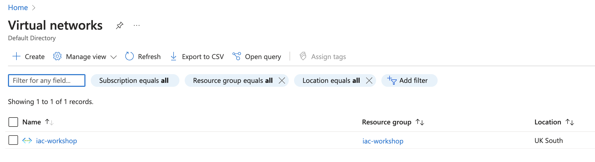

# Terraform Azure Networking Module

## Overview

Welcome to the terraform-azure-networking module! This repository is part of the IaC Best Practices Workshop, focusing on modular design and reusability in Terraform, specifically tailored for Azure networking resources.

This module aims to provide a foundational understanding of how to structure Terraform code in a modular way, enabling easier management, scalability, and reusability of the codebase.

## Module Description

The `terraform-azure-networking`` module is designed to create and manage Azure networking components, including virtual networks, subnets, and other related resources.

The module is structured to demonstrate best practices in Terraform module development.

## Workshop Exercise

### Objectives

- Understand and apply best practices in Terraform module design.
- Create a reusable Terraform module for Azure networking resources.
- Learn to define and use input variables and module outputs.

## Tasks

1. Explore the Module:
   - Review the existing code to understand the module's structure.
   - Identify the components of the module (variables, outputs, resources).
2. Modify the Module:
   - Enhance the module by adding additional networking components, such as Network Security Groups or Route Tables.
   - Update variables and outputs accordingly.
3. Test the Module:
   - Use the module in a main.tf file to create a networking infrastructure.
   - Validate the execution by running `terraform init`, `terraform plan`, and `terraform apply`.
4. Document Your Changes:
   - Update this `README.md` to reflect the changes you made to the module.
   - Ensure clear documentation for future users of your module.

## Prerequisites

- Basic understanding of Terraform and Azure.
- Terraform installed on your machine.
- Access to an Azure account with necessary permissions.
- Azure CLI installed on your machine.
- Perform `az login` before run the terraform commands

## Usage

To see how you can use this module, change directory to `usage` directory inside this project.

```sh
cd ./usage
```

Explore folder content. You will find a file named `main.tf` containing the following code:

```hcl
module "azure_network" {
  source = "github.com/iac-best-practices-workshow/terraform-azure-networking"

  location            = "uksouth"
  resource_group      = "iac-workshop"
  vnet_name           = "iac-workshop"
  subnet_name         = "iac-workshop"
}
```

This code shows you that you can reference any module by referecing its GitHub repository.

Following, provision the resources running `terraform init` followed by `terraform apply`.

```sh
terraform init
terraform plan
``````

It should produce an output like as follows (notice that 3 resources will be created):

```txt
Terraform used the selected providers to generate the following execution plan. 
Resource actions are indicated with the following symbols:
  + create

Terraform will perform the following actions:

  # module.azure_network.azurerm_resource_group.resource-group will be created
  + resource "azurerm_resource_group" "resource-group" {
      + id       = (known after apply)
      + location = "uksouth"
      + name     = "iac-workshop"
    }

  # module.azure_network.azurerm_subnet.subnet will be created
  + resource "azurerm_subnet" "subnet" {
      + address_prefixes                               = [
          + "10.0.1.0/24",
        ]
      + enforce_private_link_endpoint_network_policies = (known after apply)
      + enforce_private_link_service_network_policies  = (known after apply)
      + id                                             = (known after apply)
      + name                                           = "iac-workshop"
      + private_endpoint_network_policies_enabled      = (known after apply)
      + private_link_service_network_policies_enabled  = (known after apply)
      + resource_group_name                            = "iac-workshop"
      + virtual_network_name                           = "iac-workshop"
    }

  # module.azure_network.azurerm_virtual_network.vnet will be created
  + resource "azurerm_virtual_network" "vnet" {
      + address_space       = [
          + "10.0.0.0/16",
        ]
      + dns_servers         = (known after apply)
      + guid                = (known after apply)
      + id                  = (known after apply)
      + location            = "uksouth"
      + name                = "iac-workshop"
      + resource_group_name = "iac-workshop"
      + subnet              = (known after apply)
    }

Plan: 3 to add, 0 to change, 0 to destroy.

────────────────────────────────────────────────────────────────────────
```

When asked if you want to perform these actions answer 'yes':

```txt
Do you want to perform these actions?
  Terraform will perform the actions described above.
  Only 'yes' will be accepted to approve.

  Enter a value: yes
```

After execution, you will see the Vnet created in Azure portal:



### Workshop clean up

To avoid unwanted charges, after finalizing the workshop, you should destroy the created resources running `terraform destroy`. Again, when asked if you want to destroy all resources answer `yes`:

```sh
terraform destroy
...
Plan: 0 to add, 0 to change, 3 to destroy.

Do you really want to destroy all resources?
  Terraform will destroy all your managed infrastructure, as shown above.
  There is no undo. Only 'yes' will be accepted to confirm.

  Enter a value: yes
...
Destroy complete! Resources: 3 destroyed.
```

Congrats, you just learned how to reference a Terraform module.

## Contributing

We encourage workshop participants to contribute to this module! Please follow the guidelines outlined in the workshop for making changes and submitting pull requests.

License
[MIT]
